### 任务路由系统（含图谱混合检索）

---

## 一、项目概览

- **目标**：旅长用自然语言下达指令，系统根据《作战指挥手册》自动检索依据，并路由到正确的牵头负责角色。
- **核心能力**：
  - **多路检索**：向量检索 + BM25（Elasticsearch）+ 图谱检索（Neo4j 流程图谱），通过 RRF 融合。
  - **智能路由**：结合检索结果与 LLM，给出“谁牵头、谁参与、谁审批”的结构化决策及依据。
  - **数据管理**：文档上传与处理、结构树浏览、Chunk 浏览、OCR/异常审核、角色/同义词/层级配置等。

主要目录：

- `backend/`：FastAPI 后端（检索 + 路由 + 数据处理）
- `frontend/`：Vue 3 + Element Plus 前端
- `main.py`：统一启动脚本（启动 ES、后端、前端）
- `docker/`：Milvus 单机编排（`milvus-standalone-compose.yml`）
- `docs/`：接口说明与技术方案文档

---

### 后端 `backend/app` 各文件职责

| 路径 | 作用 |
|------|------|
| `main.py` | FastAPI 入口：CORS、路由注册、`lifespan` 中刷新 Chunk 缓存并关闭 ES / Milvus / Neo4j 等连接。 |
| `config.py` | `pydantic-settings` 读取环境变量与 `.env`：LLM、Embedding、Milvus、ES、Neo4j、检索与**重排**参数。 |
| `models/schemas.py` | 请求/响应与领域模型：Chunk、路由结果、`SearchResultItem`、检索对比结构等。 |
| `utils/rrf.py` | **RRF（Reciprocal Rank Fusion）** 多列表融合，支持按通道权重加权。 |
| `services/embedding.py` | 文本向量化：Ollama 主通道、SiliconFlow 备用；`encode_for_vector_search` 支持查询前缀。 |
| `services/vector_store.py` | **Milvus**：建集合、HNSW+COSINE 索引、按 `phase/scope/battle_type` 过滤的向量检索。 |
| `services/index_builder.py` | 离线建索引：全量 Embedding → Milvus；同义词注入 ES IK → BM25 索引。 |
| `services/search.py` | **混合检索编排**：向量 + BM25 + 图谱并行 → 加权 RRF → 可选**重排** → 截断 `FINAL_TOP_K`。 |
| `services/rerank.py` | **交叉编码器重排**：调用 SiliconFlow `/v1/rerank`（默认 `bge-reranker-v2-m3`），失败则回退 RRF 顺序。 |
| `services/graph_search.py` | Neo4j：全文检索 Task（混合检索图谱路）、`role_tasks` / `task_decompose` 等图谱 API 用 Cypher。 |
| `services/graph_builder.py` | 流程图谱构建写入 Neo4j（与 `graph_search` 读写对应）。 |
| `services/data_manager.py` | 读写 `data/` 下 chunks、角色表、同义词、文档元数据等 JSON。 |
| `services/router_judge.py` | 结合检索到的 Chunk 与角色表，调用 LLM 输出牵头/参与/审批与依据。 |
| `services/intent.py` | 从旅长自然语言中抽取**检索子句**（供检索用）。 |
| `services/llm_client.py` | 统一封装 DeepSeek/OpenAI 兼容 HTTP 调用。 |
| `services/document_processor.py` | 文档处理流水线编排（纠错、解析、分块等）。 |
| `services/ocr_correction.py` | OCR/文本纠错与日志。 |
| `services/structure_parser.py` | 章节结构解析。 |
| `services/chunker.py` | 分块与 Chunk 生成。 |
| `services/role_annotator.py` / `role_extractor.py` | 角色提及标注与抽取。 |
| `routers/chat.py` | `POST /chat`：意图 → 混合检索（含重排）→ 路由判定。 |
| `routers/resolve.py` | 实体/任务解析类接口，内部复用混合检索。 |
| `routers/search.py` | `POST /search/comparison`：分路结果 + RRF + **rerank_results** 对比。 |
| `routers/graph.py` | 图谱查询 REST（任务拆解、角色任务等）。 |
| `routers/documents.py` | 文档上传、处理、建索引、删除。 |
| `routers/chunks.py` / `structure.py` / `roles.py` / `synonyms.py` / `level_patterns.py` / `review.py` | 各配置与浏览类 API。 |

### 根目录与前端要点

| 路径 | 作用 |
|------|------|
| `main.py` | 一键拉起 ES（可选）、后端 uvicorn、前端静态站与 `/api` 反代。 |
| `test_api_flows.py` | 接口串联验证脚本（需服务已启动）。 |
| `frontend/src/App.vue` / `router/index.js` | 布局与路由。 |
| `frontend/src/api/index.js` | 后端 API 封装。 |
| `frontend/src/views/RoutingQuery.vue` | 路由查询页。 |
| `frontend/src/views/SearchComparison.vue` | 检索对比（向量/BM25/图谱/RRF/**重排**）。 |
| `frontend/src/views/RoleManagement.vue` 等 | 各业务页。 |

---

### 检索与重排逻辑（详解）

系统对**用户查询**同时走多路召回，再用 **RRF** 合并排序，最后用**重排模型**对候选精排（与 `POST /chat`、解析类接口一致）。

```mermaid
flowchart TB
  subgraph recall [多路召回 并行]
    V[向量检索 Milvus]
    B[BM25 Elasticsearch]
    G[图谱全文 Neo4j task_fulltext]
  end
  Q[用户 query] --> V
  Q --> B
  Q --> G
  F[上下文过滤 phase / battle_type / scope] --> V
  F --> B
  V --> RRF[加权 RRF 融合]
  B --> RRF
  G --> RRF
  RRF --> POOL[取 RRF 前 RERANK_CANDIDATE_POOL 条]
  POOL --> RK{重排已配置?}
  RK -->|是 SiliconFlow rerank| RR[交叉编码器打分重排]
  RK -->|否| OUT[截断 FINAL_TOP_K]
  RR --> OUT
```



**步骤说明：**

1. **向量路（Milvus）**  
   - 索引字段与建库一致：`title_chain + "\n" + text` 做 Embedding；查询侧经 `EMBEDDING_QUERY_PREFIX`（可选）后再向量化。  
   - 度量：**余弦距离**（语义相近得分高）。  
   - 支持按 `phase`、`battle_type`、`scope` 标量过滤（与 Chunk 元数据一致）。

2. **BM25 路（Elasticsearch）**  
   - `bool` + 多 `should`：`multi_match`（`text^3`、`title^2`、`title_chain^1.5`，`best_fields`）+ `match_phrase`（正文/标题链，短语更准）+ `roles_mentioned` 加权。  
   - `filter` 中叠加上下文 term 过滤。  
   - 同义词在索引构建时写入 IK 分析链。

3. **图谱路（Neo4j）**  
   - 对 Task/TaskGroup 节点的全文索引 `task_fulltext` 做查询，返回 `chunk_id` 与相关度。  
   - **不参与** Milvus/ES 的 phase 过滤（与当前实现一致）。

4. **加权 RRF**  
   - 各路先取 **`HYBRID_PER_CHANNEL_TOP_K`** 条（默认大于单路调试的 TopK），再融合。  
   - 默认权重：向量 **1.15**、BM25 **1.0**、图谱 **0.9**（可在 `.env` 调整）。  
   - 公式：对每路第 `rank` 名文档累加 `weight / (RRF_K + rank)`，总分降序。

5. **重排（Rerank）**  
   - 在 RRF 全序上取前 **`RERANK_CANDIDATE_POOL`** 条（默认 24），将每条 Chunk 拼成短文档（`title_chain` + `title` + `text`，截断 `RERANK_MAX_DOC_CHARS`），调用 **`RERANK_API_URL`**（默认 SiliconFlow `/v1/rerank`，模型 `BAAI/bge-reranker-v2-m3`）。  
   - **API Key**：优先 `RERANK_API_KEY`，为空则用 **`SILICONFLOW_API_KEY`**。未配置密钥或 `RERANK_ENABLED=false` 时**跳过重排**，直接按 RRF 顺序截断。  
   - 接口失败时**回退**为 RRF 顺序，避免聊天中断。  
   - 返回给前端的 `source` 在重排成功时为 `rerank`，`score` 为模型相关性分。

6. **最终输出**  
   - 取重排（或 RRF）结果的前 **`FINAL_TOP_K`** 条，作为路由 LLM 的上下文依据。

调试：调用 **`POST /api/v1/search/comparison`** 可同时查看 `vector_results`、`bm25_results`、`graph_results`、**`rrf_results`（纯 RRF TopK）**、**`rerank_results`（与线上一致）** 及 **`rerank_meta`**。

---

## 二、环境与启动

### 2.1 依赖服务

- **Milvus 2.6（向量库）**
  - gRPC 端口：`19530`（与 `backend/.env` 中 `MILVUS_HOST`、`MILVUS_PORT` 一致，默认 `127.0.0.1:19530`）。
  - 本机 Docker 一键起（etcd + minio + standalone，数据在 `docker/milvus-volumes/`）：
    ```bash
    docker compose -f docker/milvus-standalone-compose.yml up -d
    ```
  - 健康检查：`http://127.0.0.1:9091/healthz`（容器内 metrics/health）。
- **Elasticsearch 8.x**
  - 端口：`9200`
  - Windows 下由 `soft/elasticsearch-8.12.0/bin/elasticsearch.bat` 启动（`main.py` 会自动拉起）。
- **Neo4j 5.x**
  - 地址：`bolt://localhost:7687`（浏览器 HTTP 端口 7474）
  - 账号密码：`neo4j / neo4j@openspg`
  - **无需手动建图谱和索引**：前端"文档管理"页提供"构建流程图谱"按钮，点击后自动完成图谱导入和全文索引创建。

- **向量服务（Embedding）**
  - 默认配置：`EMBEDDING_URL=http://192.168.1.200:11434/api/embeddings`
  - 需要保证该地址可用，否则索引构建会失败（见后文“建索引问题排查”）。

- **重排服务（Rerank，可选但推荐）**
  - 默认走 **SiliconFlow** `POST /v1/rerank`，需配置 **`SILICONFLOW_API_KEY`**（或单独 `RERANK_API_KEY`）。未配置时自动跳过重排，仅 RRF。  
  - 相关环境变量：`RERANK_ENABLED`、`RERANK_MODEL`、`RERANK_CANDIDATE_POOL` 等（见 `backend/app/config.py`）。

### 2.2 Python 环境与后端依赖（推荐虚拟环境）

**前提**：已安装 **Python 3.12**（建议）。Windows 若命令行里没有 `python`，可试 **`py`**（Python 启动器）。

**步骤**（均在项目根目录 `chosen/` 下操作）：

1. **进入项目根目录**  
   - PowerShell：`Set-Location f:\chosen`（按你的实际路径修改）。

2. **创建虚拟环境**（只需执行一次；已存在 `.venv` 可跳过）  
   - `py -3.12 -m venv .venv`  
   - 或：`python -m venv .venv`

3. **激活虚拟环境**  
   - **PowerShell**：`.\.venv\Scripts\Activate.ps1`  
     - 若提示无法加载脚本：先执行 `Set-ExecutionPolicy -Scope Process -ExecutionPolicy Bypass`，再激活。  
   - **cmd**：`.\.venv\Scripts\activate.bat`

4. **升级 pip 并安装依赖**（激活后提示符前一般有 `(.venv)`）  
   - `python -m pip install --upgrade pip`  
   - `pip install -r backend\requirements.txt`  
   - （Linux/macOS 将路径写为 `backend/requirements.txt` 即可。）

5. **在 IDE 中选解释器（可选）**  
   - 选择：`项目根\.venv\Scripts\python.exe`，与上述环境一致。

6. **之后每次开发**  
   - 先激活 `.venv`，再在根目录执行 `python main.py`。

**不推荐**：在未激活虚拟环境时，直接在 `backend` 里对全局 Python 执行 `pip install -r requirements.txt`，容易与系统或其它项目冲突。

关键依赖：`fastapi`、`uvicorn[standard]`、`pymilvus`、`elasticsearch[async]`、`neo4j`、`httpx`、`loguru`、`tenacity` 等。

### 2.3 前端依赖与构建

```bash
cd frontend
npm install
npm run build
```

生成的构建产物在 `frontend/dist`，由 `main.py` 的内置 HTTP 服务托管。

### 2.4 一键启动

在项目根目录、且已按 **2.2** 激活 `.venv`（或 IDE 已选用该解释器）后执行：

```bash
python main.py
```

启动顺序（由 `main.py` 控制）：

1. **Elasticsearch**：检查 9200 端口，若未运行且有 `elasticsearch.bat` 则自动启动。
2. **后端 API**：`uvicorn app.main:app --host 0.0.0.0 --port 8000`。
3. **前端**：在 3010 端口启动静态站点，所有 `/api/*` 自动反向代理到 `http://127.0.0.1:8000`。

访问地址：

- 前端界面：`http://localhost:3010`
- API 文档：`http://localhost:8000/docs`

Ctrl+C 可退出并尝试关闭子进程。

---

## 三、前端使用说明

前端使用 Vue 3 + Element Plus，左侧为菜单栏，右侧为各功能页面。

### 3.1 菜单与页面

- **核心功能**
  - `路由查询` (`/routing`)：旅长自然语言指令 → 路由结果。
  - `检索对比` (`/search`)：对比向量 / BM25 / 图谱 / RRF 检索效果。
- **数据浏览**
  - `结构浏览` (`/tree`)：按章节树查看文档结构和关联 Chunk。
  - `Chunk 详情` (`/chunks`)：按 Chunk 维度浏览内容和元数据。
- **审核管理**
  - `OCR 审核` (`/ocr-review`)：人工审核 OCR 纠错结果。
  - `异常审核` (`/anomaly-review`)：处理结构/角色等异常条目。
- **系统配置**
  - `角色管理` (`/roles`)：维护角色列表。
  - `同义词管理` (`/synonyms`)：维护检索同义词组。
  - `层级配置` (`/level-patterns`)：配置标题层级正则。
  - `文档管理` (`/documents`)：上传/处理/建索引。

### 3.2 路由查询页（/routing）

- 输入框：输入旅长指令（如“组织侦察情报准备”），回车或点击右侧“发送”按钮。
- 右侧过滤条件：
  - `战斗阶段`：如“战斗准备”“战斗实施”等。
  - `战斗类型`：如“进攻战斗”“防御战斗”。
- 返回内容：
  - 牵头负责角色、参与协助、审批角色。
  - 置信度条。
  - 依据 Chunk 的章节路径和片段。
  - 右侧卡片展示本次检索返回的若干相关 Chunk。

### 3.3 检索对比页（/search）

- 顶部输入框：输入检索语句，点击“检索对比”；可选勾选向量 / BM25 / 图谱通道。
- 下方四列：向量、BM25、图谱、**RRF 融合**（纯 RRF TopK，与重排前一致）。
- 其下：**重排结果**（与 `POST /chat` 实际使用的顺序一致；未配置重排 API 时会提示原因）。
- 每条结果显示：排名、标题、章节路径、得分、文本前若干字。

### 3.4 文档管理页（/documents）

- 顶部“上传文本”：上传 `.txt` 手册原文。
- 表格操作列：
  - `处理 / 重新处理`：触发 OCR 纠错、结构解析、分块等离线流程。
  - `建索引`：在文档处理完成后，构建向量索引 + ES 索引。
  - `删除`：删除文档及其相关数据。

### 3.5 结构浏览页（/tree）

- 左侧：
  - 选择文档 → 加载其章节结构树。
  - 点击树节点可查看详情。
- 右侧：
  - 节点基础信息（ID、层级、行范围、子节点数）。
  - 节点文本（概述内容）。
  - 与该节点关联的 Chunks 列表（overview/detail）。

---

## 四、后端接口设计（核心部分）

所有接口均以 `/api/v1` 为前缀。每个接口的**功能**、**使用场景**、**概述**详见 [docs/API接口文档.md](docs/API接口文档.md)。

### 4.1 路由主接口：聊天 + 混合检索

- **URL**：`POST /api/v1/chat`
- **描述**：旅长自然语言指令 → 牵头/参与/审批 + 依据。
- **请求体**：

```json
{
  "input": "组织侦察情报准备",
  "context": {
    "phase": "战斗准备",
    "battle_type": "进攻战斗"
  },
  "retrieval": {
    "use_vector": true,
    "use_bm25": true,
    "use_graph": true
  }
}
```

- 字段说明：
  - `input`：必填，自然语言指令。
  - `context`：可选，检索过滤（`phase`, `battle_type`, `scope`）。
  - `retrieval`：可选，多路检索开关（不传则三路全开）。
    - `use_vector`：向量检索。
    - `use_bm25`：BM25 检索（ES）。
    - `use_graph`：图谱检索（Neo4j）。

- **响应**（简化）：

```json
{
  "result": {
    "lead": "侦察情报要素",
    "participants": ["指挥员", "参谋长"],
    "approver": "参谋长",
    "reasoning": "……",
    "confidence": 0.92,
    "basis": {
      "chunk_id": "ch2_s1_p1_t2_03",
      "title_chain": "……",
      "text_snippet": "……"
    }
  },
  "search_results": [
    {
      "chunk_id": "…",
      "title": "…",
      "title_chain": "…",
      "text": "…",
      "score": 0.94,
      "source": "rrf"
    }
  ]
}
```

### 4.2 检索对比接口

- **URL**：`POST /api/v1/search/comparison`
- **描述**：同时返回向量 / BM25 / 图谱 / RRF 结果，用于调试与分析。
- **请求体**：

```json
{
  "query": "组织侦察情报准备",
  "filters": {
    "phase": "战斗准备",
    "battle_type": "进攻战斗",
    "scope": "旅"
  },
  "retrieval": {
    "use_vector": true,
    "use_bm25": true,
    "use_graph": true
  }
}
```

- **响应**：

```json
{
  "query": "组织侦察情报准备",
  "vector_results": [ { /* SearchResultItem */ } ],
  "bm25_results":   [ { /* SearchResultItem */ } ],
  "graph_results":  [ { /* SearchResultItem */ } ],
  "rrf_results":    [ { /* SearchResultItem */ } ]
}
```

其中 `SearchResultItem`：

```json
{
  "chunk_id": "ch2_s1_p1_t2_03",
  "title": "3.制定侦察计划",
  "title_chain": "…",
  "text": "…",
  "score": 0.94,
  "source": "vector | bm25 | graph | rrf"
}
```

### 4.3 检索缓存管理

- **URL**：`POST /api/v1/search/refresh-cache`
- **描述**：重新从本地数据加载所有 Chunk 到内存缓存。
- **响应**：

```json
{
  "message": "Cache refreshed",
  "total_chunks": 153
}
```

### 4.4 文档与索引相关接口（简要）

- 文档：
  - `GET /api/v1/documents`：文档列表。
  - `POST /api/v1/documents/upload`：上传 `.txt` 文本。
  - `POST /api/v1/documents/{doc_id}/process`：处理文档（OCR/解析/分块）。
  - `POST /api/v1/documents/{doc_id}/reprocess`：重新处理。
  - `DELETE /api/v1/documents/{doc_id}`：删除。
  - `POST /api/v1/documents/build-indexes`：构建向量索引 + ES 索引。
- Chunk：
  - `GET /api/v1/chunks`：列表，支持 `doc_id` 过滤。
  - `GET /api/v1/chunks/{chunk_id}`：单个 Chunk。
  - `GET /api/v1/chunks/stats/summary`：统计信息。
- 结构树：
  - `GET /api/v1/structure`：所有文档结构概览。
  - `GET /api/v1/structure/{doc_id}`：单文档结构树。

### 4.5 任务解析接口（自然语言 → Task 节点）

- **URL**：`POST /api/v1/resolve`
- **描述**：自然语言查询 → 匹配到的 Task 节点（桥梁接口，无 LLM）。
- **请求体**：

```json
{
  "query": "组织侦察情报",
  "top_k": 3,
  "retrieval": { "use_vector": true, "use_bm25": true, "use_graph": true }
}
```

- **响应**：

```json
{
  "matches": [
    {
      "chunk_id": "ch2_s1_p1_t2",
      "task_name": "（二）组织侦察情报",
      "title_chain": "第二章 > 第一节 > 一、战斗准备 > （二）组织侦察情报",
      "node_type": "TaskGroup",
      "has_subtasks": true,
      "score": 0.96
    }
  ]
}
```

### 4.6 流程图谱接口

所有图谱接口前缀为 `/api/v1/graph`。

- **图谱构建**
  - `POST /api/v1/graph/rebuild?use_llm=false`：重建图谱（后台任务）。
    - `use_llm=false`（默认）：仅规则抽取，快速无误。
    - `use_llm=true`：规则抽取 + LLM 语义补全（LED_BY/DEPENDS_ON/PRODUCES）。
  - `GET /api/v1/graph/stats`：图谱节点/关系统计。

- **角色职责查询**
  - `GET /api/v1/graph/role_tasks?role=侦察情报要素&phase=战斗准备`
  - 响应：该角色在该阶段负责/参与/审批的所有任务列表。

- **任务角色分工**
  - `GET /api/v1/graph/task_roles?chunk_id=ch2_s1_p1_t2_03`
  - 也支持：`?task_name=制定侦察计划`（走全文索引模糊匹配）。
  - 响应：`{ "roles": { "led_by": "侦察情报要素", "involves": [...], "approved_by": "参谋长" } }`

- **任务拆解**
  - `GET /api/v1/graph/task_decompose?chunk_id=ch2_s1_p1_t2`
  - 响应：子步骤列表（含 step/led_by/produces/depends_on）。

- **前置依赖**
  - `GET /api/v1/graph/task_prerequisites?chunk_id=ch2_s1_p1_t2_03`
  - 响应：前置任务链。

- **任务产物**
  - `GET /api/v1/graph/task_products?role=侦察情报要素&phase=战斗准备`
  - 也支持：`?chunk_id=ch2_s1_p1_t2_03`
  - 响应：产物列表。

- **任务详情（图谱 + 原文）**
  - `GET /api/v1/graph/task_detail?chunk_id=ch2_s1_p1_t2_03`
  - 响应：完整图谱关系（led_by/approved_by/involves/produces/depends_on/parent/prev/next）+ 原文。

---

## 五、建索引失败问题说明（502 Bad Gateway）

当在“文档管理”页点击“建索引”按钮时，会触发后端：

- `POST /api/v1/documents/build-indexes` → `IndexBuilder.build_all_indexes()`：
  - `build_vector_index()`：调用 `EmbeddingService.encode()`，访问 `settings.EMBEDDING_URL`。
  - `build_es_index()`：建立 ES 索引。

日志中看到的错误：

- `httpx.HTTPStatusError: Server error '502 Bad Gateway' for url 'http://192.168.1.200:11434/api/embeddings'`
- `tenacity.RetryError`：说明重试 3 次后仍然失败。

这表示：

- **后端代码逻辑正常**，但 **Embedding 服务地址不可用或返回 502**。
- `EmbeddingService.encode()` 会对每条文本调用一次 HTTP 接口，如果远端服务挂了，就会在重试后抛出异常，中断“向量索引构建”。

### 解决建议

1. **检查 Embedding 服务**
   - 确认 `192.168.1.200:11434` 是否可访问。
   - 在服务端或本机执行：
     - `curl http://192.168.1.200:11434/api/embeddings`
   - 确保返回 200，而不是 502。

2. **如服务地址变更**
   - 修改 `backend/app/config.py` 中：
     - `EMBEDDING_URL`
     - `EMBEDDING_MODEL`（按实际服务要求调整）。
   - 或在 `.env` 中覆盖：

```env
EMBEDDING_URL=http://<新的地址>/api/embeddings
EMBEDDING_MODEL=bge-large
```

3. **重新启动后再点“建索引”**
   - 保证向量服务可用 → 重启后端 → 在前端“文档管理”中重新点击“建索引”。

> 当前实现按你的原则：不做兼容兜底。如果 Embedding 服务不可用，就直接失败抛错，不做静默降级，这样问题会更明显。

